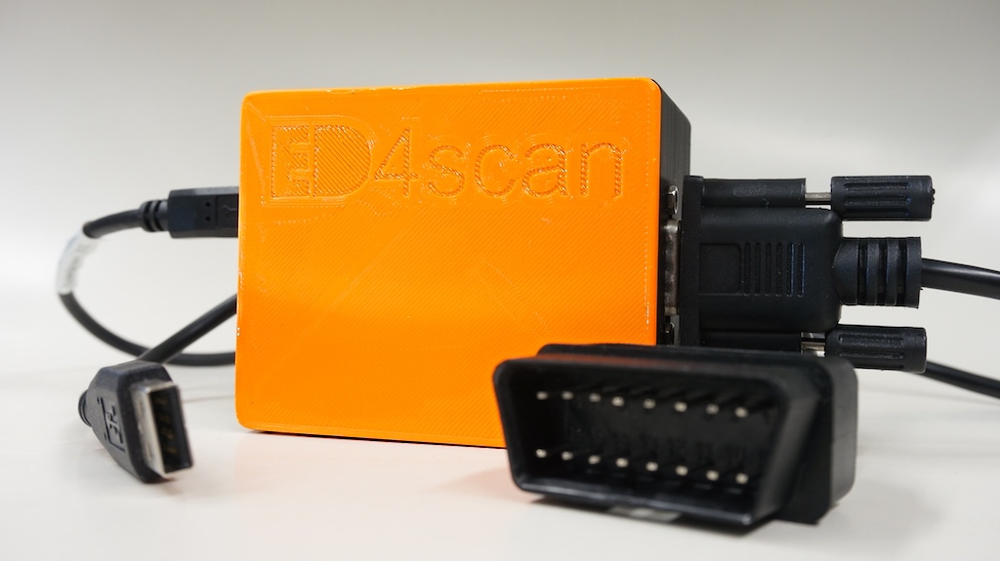
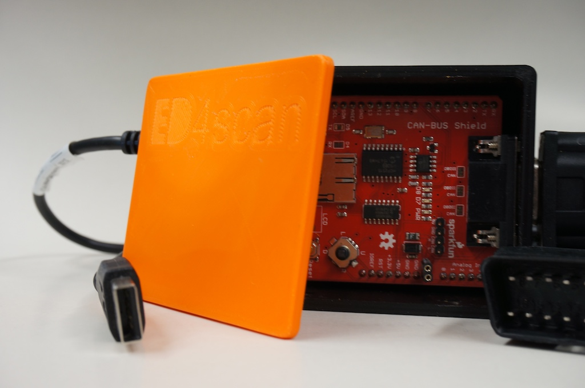
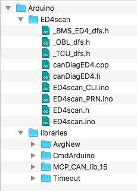
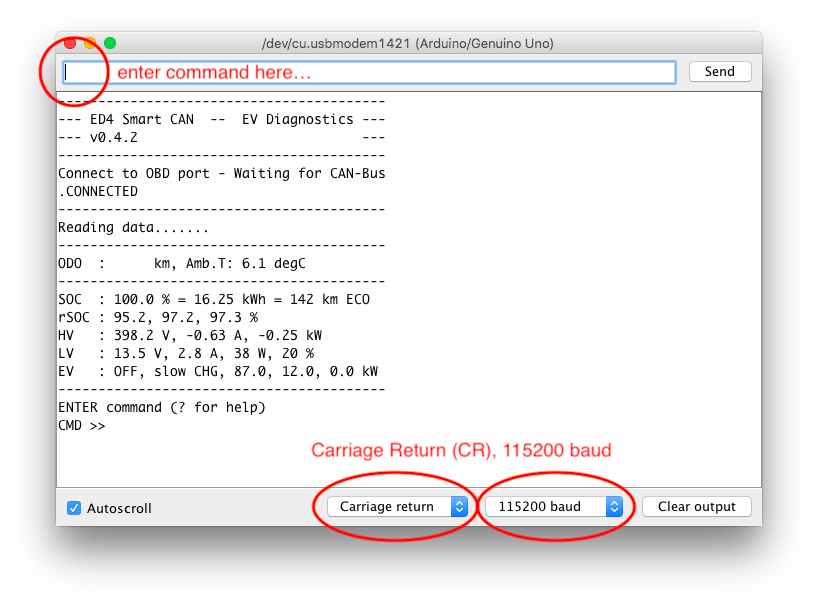

# ED4scan

Retrieve battery diagnostic data from your 453 series smart electric drive EV / EQ. Get an overview of the EV state, the health of the battery or dig into more detailed measurements.  

>**Please find further documentation of the usage and hints in the [ED4scan wiki](https://github.com/MyLab-odyssey/ED4scan/wiki).**  
**This is the 1st public release and may contain errors - USE AT YOUR OWN RISK!**  
**The software will only work with the forth generation Smart electric drive build from 2017+ .**

---
## Why this project?
With this small tool I want to empower interested EV drivers to understand their car better and help other drivers via forums to do so. With this new form of mobility still in the early days we need the insight into the technology, so we get the idea behind the concepts and use it well. Share your findings in user forums: keep an eye on the health of the traction battery and improve your driving with the information regarding charging, energy efficiency and usable range of the car.
I did spend a lot of hours around the car, digging into the subsystems and reverse engineer the messages. This time my approach was to directly scan for usable Diagnostic IDs (DIDs) and try to correlate them with my charging data, EMI measurements and driving measurements. Scanning for live traffic was not the purpose. The new Smart electric drive (Series 453) is based upon a lot of Renault technology and shares systems with the Renault ZOE / Nissan cars. I want to thank the [CanZE team](https://github.com/fesch/CanZE) for their tool, as I got aware of a lot of possible CAN DIDs (especially the uncommon 0x21 query ;-) ) and base addresses of the used ECUs. The Smart shares a lot of those queries, but will deliver the content of the responses in different format. But their findings were a first step and helped a lot! THX!

## You need
The project is based upon my [ED_BMSdiag tool](https://github.com/MyLab-odyssey/ED_BMSdiag) for the ED3 (451 series) and will use the same Arduino hardware. For some details I will include related documentation.
To get started you need an Arduino with a CAN bus shield to connect to the diagnostics port (OBDII-connector) of your car. Find information about usable [CAN-Shields here](https://github.com/MyLab-odyssey/ED_BMSdiag/wiki/CAN-Bus-Basics). If you have trouble getting a CAN connection please see the [Troubleshooting and Tips](https://github.com/MyLab-odyssey/ED_BMSdiag/wiki/Troubleshooting-and-Tips) section.

Get the hardware and use an appropriate cable for the physical connection. See the schematics for making your own cable.

## Get started
* Download the [ZIP file](https://github.com/MyLab-odyssey/ED4scan/archive/master.zip), then copy the files to your **Arduino folder** (location depends on OS). The folder structure should look like this:

* Open the `ED4scan.ino` file and compile / upload it to the Arduino board.  

* **Find detailed installation instructions in: [english](https://github.com/MyLab-odyssey/ED4scan/wiki/Installation) | [german](https://github.com/MyLab-odyssey/ED4scan/wiki/Installation_DE).**

> **Verified to work with Arduino IDE 1.8.5 (on OS X 10.13 and WIN-Systems)**

## Usage: SOLELY AT YOUR OWN RISK!
Connect the CAN shield to the OBDII-connector and power up the car.

This simple tool will display the diagnostics via a serial USB connection. The readout will be started by entering commands after the prompt. See the [Wiki for further details of the CLI](https://github.com/MyLab-odyssey/ED4scan/wiki/Command-Line-Interface).

>**You need to open the serial monitor of the Arduino-IDE (Tools > Serial Monitor).  Verify that it is set to CR = Carriage Return and the baud rate is 115200.**

## Informal warning
The software does communicate with the systems within your car. It is solely intended for the use of the immobile car standing still. Do not use it while driving, as it is not tested for this usecase. Everything is reverse engineered and the software may contain errors! DO NOT MODIFY THE SOURCE CODE AND ALTER PARAMETERS THAT ARE SENT TO THE CARS SYSTEMS!

## Formal disclaimer
**THIS SOFTWARE ("ED4SCAN ") IS ONLY INTENDED FOR SCIENTIFIC USAGE**
AND IS PROVIDED BY THE COPYRIGHT HOLDER OR CONTRIBUTORS "AS IS" AND
ANY EXPRESS OR IMPLIED WARRANTIES, INCLUDING, BUT NOT LIMITED TO, THE IMPLIED
WARRANTIES OF MERCHANTABILITY AND FITNESS FOR A PARTICULAR PURPOSE ARE
DISCLAIMED. IN NO EVENT SHALL THE COPYRIGHT HOLDER OR CONTRIBUTORS BE LIABLE FOR
ANY DIRECT, INDIRECT, INCIDENTAL, SPECIAL, EXEMPLARY, OR CONSEQUENTIAL DAMAGES
(INCLUDING, BUT NOT LIMITED TO, PROCUREMENT OF SUBSTITUTE GOODS OR SERVICES;
LOSS OF USE, DATA, OR PROFITS; OR BUSINESS INTERRUPTION) HOWEVER CAUSED AND ON
ANY THEORY OF LIABILITY, WHETHER IN CONTRACT, STRICT LIABILITY, OR TORT
(INCLUDING NEGLIGENCE OR OTHERWISE) ARISING IN ANY WAY OUT OF THE USE OF THIS
SOFTWARE, EVEN IF ADVISED OF THE POSSIBILITY OF SUCH DAMAGE.

## Version History
|version  | comment|
|-------- | --------|
|v0.4.4   | **Please also reload library files**|
|         | THX to MineCooky I was able to adapt to the new BMS rev. for the EQ series. 22kW charger will be implemented next.|
|         | In addition minor bug fixes are included: AvgNew-Library optimized, warnings fixed.|
|v0.4.3   | THX to input from Jim, I fixed all warnings in ED4scan and optimized 7kW OBC test. Reviewing libs in some days...|
|v0.4.2   | 1st public release|

(For more entries/details see VERSIONS.md)
