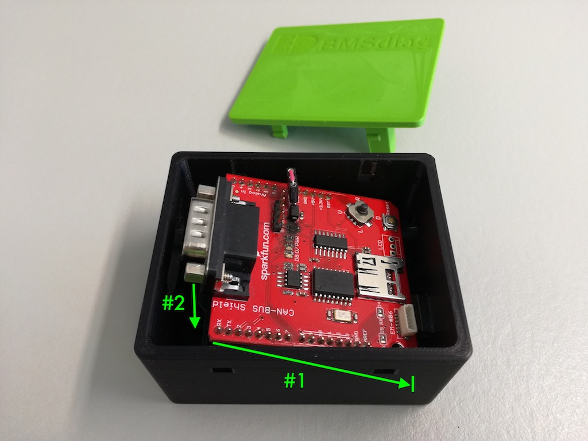

# OpenSCAD Arduino CAN bus cases
Here you will find designs for Arduino UNO CAN bus cases, that are designed with OpenSCAD and will include the rendered STL data. I will provide different versions for the specific CAN shields:

1. [Sparkfun CAN bus shield v1.3](https://github.com/sparkfun/CAN-Bus_Shield)  
  Assemble by inserting the Arduino with the mounted CAN bus shield and slide it to the right (#1) into the USB and DC connector holes. Then press it down to fit the D-Sub connector hole (#2). The case is designed with a tight fit, so you should apply some pressure. Then move the stack completely to the left side, positioning the D-Sub connector against the housing (#3). Now you can snap in the lid. The guidance pins will secure the stack within the case (#4) and minimize possible clearance.

  

  
  

  

  
  

